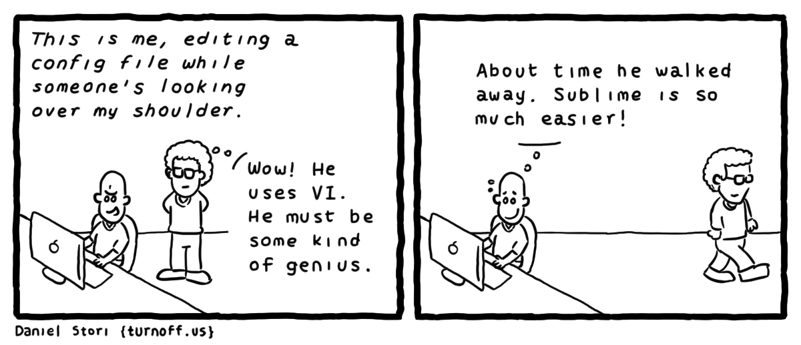

# Efficient Text Editing with Atom

The following lesson should take about `75 minutes` and includes a lab for the students to practice some of the powerful editing features of Sublime.

The main purpose of this lesson is to get students comfortable with the Atom editor, including how to configure it, install plugins, and get *greedy* about discovering faster, more efficient ways of editing files.

{{TOC}}

## Core Competencies

Students will be able to:

* Explain the difference between text files and binary files
* Install Atom using brew cask
* Modify the configuration of Atom to set the theme, font, tab settings, etc.
* Launch Atom from the command line
* Use Find to search the current file or all of the files
* Change the layout to 2up, 3up, 4up, etc.
* Install Atom plugins
* Use cool Atom editing tricks such as:
  - select and edit several lines at once
  - select and edit in "column mode"
  - move the selected line up or down
* Use keyboard shortcuts to save time



## Install Brew

Copy and Paste into your terminal window:

```bash
ruby -e "$(curl -fsSL https://raw.githubusercontent.com/Homebrew/install/master/install)"
```

## Install Cask, Cask Versions and Sublime Text 3

```bash
brew tap caskroom/cask
brew tap caskroom/versions
brew cask install atom
```

## What is a Text Editor?
* Provides an interface for viewing and modifying text files
* Text files are files containing human readable text
* Encoded via ASCII or Unicode characters
* There are different *kinds* of text editors:
  - terminal / command line: vim, emacs, nano
  - window based: Atom, Sublime, TextMate, Notepad++

## Modern Text Editors
* Can open a file or a directory
* Can understand context:
  - context sensitive help
  - may highlight errors or bad practices in your code
  - adapt to different file formats
  - provide syntax highlighting

* extensions & plugins - used to add additional features to the editor

## Types of Text Files
* Plain text
* Markdown
* CSV
* Various Programming Languages
  - HTML
  - CSS
  - JavaScript
  - Ruby
  - BASH
  - SQL
* Each programming language has a set of rules, keywords, operators, and syntax

## Atom
* Developed by GitHub
* Atom is a desktop application built with HTML, JavaScript, CSS, and Node.js integration. It runs on _Electron_, a framework for building cross platform apps using web technologies.
* multi-platform (OS X, Windows, Linux)
* popular (widely used for web development)
* open source
* free
* extensible (we can add functionality via Atom packages)

## Launching Atom

To open atom, simply click the icon in the Dash or Launchpad.
Or just type `atom` in a terminal.

To open Atom with a specific file, we can use the command line again,
but this time passing in a file name:

```bash
mkdir recipes
atom recipes/veggie_soup.txt
```

## Project mode

Real-world software projects often involve _many_ files organized into folders. It is handy to be able to see all the files in our project when working in our text editor. Sublime makes this easy as it supports a project mode. To use this we simply pass a directory instead of a file:

```bash
atom recipes
```
or...

```bash
cd recipes
atom .
```

Notice that the sidebar now has a folders section that shows all the files and folders in the project. Clicking on a folder expands the view to show its contents.

## Take a Tour of the Atom Editor Window Components

* Menu
* Sidebar
* Open files via tabs
  - can rearrange tabs
  - can change layout of tabs - `Alt-Command-<Number>`
* Edit pane
* Ruler
* Footer
  - Line #, Column #
  - White Space Mode
  - File Type

## Find (Search)

* You can search a single file or all of the open files
* You can search case sensitive or case insensitive
* You can search using regular expressions (we will talk about those later)

### Settings and themes

`cmd + ,` allows you to access the Atom's settings.

You can customize the following settings in Atom:

* Core settings - window and pane behavior, auto-updating, etc.
* Editor settings - font size, indenting, tabs vs. spaces, line height, etc.
* Keybindings - keyboard shortcuts
* Packages - view, configure, and uninstall Atom packages
* Themes - customize the look of Atom
* Install - you can install Atom packages that teach Atom new tricks!

## Code Along

In this code along we will create some files via the command line and then
edit them in Sublime.

```bash
cd ~
cd wdi
git clone https://github.com/ATL-WDI-Curriculum/text-editors.git
cd text-editors/exercises
```

Follow the instructions that start with a `#` sign to make modifications
to the text in the following files.

* eggs_and_ham.txt
* fruit.txt
* superheroes.txt
* math.txt

## References

* [Official website](https://atom.io/)
* [Atom Flight Manual](http://flight-manual.atom.io/)
* [Atom Basics](http://flight-manual.atom.io/getting-started/sections/atom-basics/)
